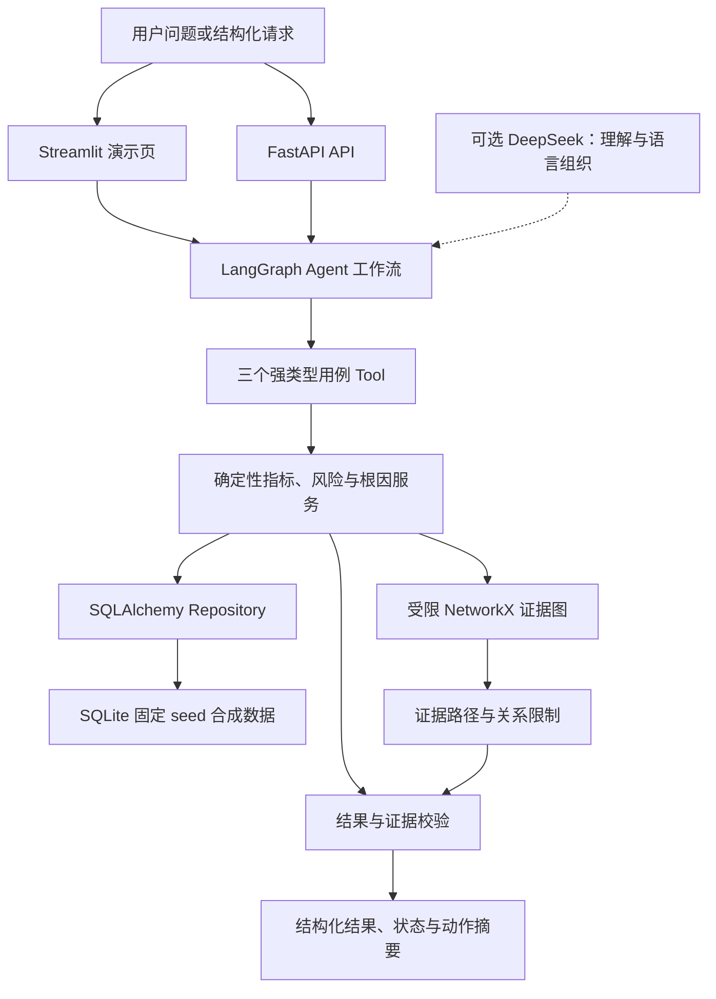

# 呆滞料智能体

一个基于**纯合成制造业数据**的呆滞料识别与库存根因分析项目。项目通过确定性代码计算库存指标、追踪业务关系和执行归因规则，再由 Agent 负责理解问题、编排工具并组织带证据的回答。

> 项目目录沿用原名“智能库存归因Agent”；“呆滞料智能体”是当前业务名称，两者指同一项目。

## 业务问题

制造企业排查呆滞库存时，通常需要在库存流水、采购单和生产单之间反复核对。只给出“某物料库存过高”不能支持后续处理，业务人员还需要知道：它多久没有消耗、涉及多少金额、可能由需求下降、超量采购还是生产延期造成，以及结论对应哪些单据和事实。

本项目把这条排查链路收敛为一个只读 Agent：用户可以查询仓库风险清单、分析单个物料根因或追溯证据路径；系统返回确定性指标、候选根因、命中规则和可核对证据。Agent 不执行报废、调拨或订单修改，也不把模型生成内容当成业务事实。

## 数据与隐私声明

- 项目只使用 `app/synthetic/` 根据固定 seed 生成的虚构物料、仓库、库存流水、采购单和生产单。
- `MAT-SYN-*`、`WH-SYN-*` 等标识均为合成标识，不对应真实企业、客户或业务系统。
- 仓库不包含公司源码、真实表名、客户数据、凭据、内部地址或实习资料原文。
- 所有测试、评测、性能与演示数字都可以通过仓库命令重新生成。

## 当前状态

当前 **v0.1.0 MVP 功能与最终验收已完成**。Agent 评测、Streamlit、可观测性、安全、性能、冷启动、项目文档、自动化演示及求职材料均已形成可复现证据。

已完成：

- 项目目标、范围边界与角色定义。
- MVP 呆滞料口径、三类候选根因和待确认业务参数。
- 五个持久化实体、最小关系图、数据质量规则与合成场景清单。
- 功能、质量与演示验收标准。
- 工程约束、依赖清单和环境差距盘点。
- 默认业务阈值已接受为合成数据 MVP v0.2 的可配置基线。
- Phase 1 分层骨架、领域枚举、阈值、五个实体和统一结果模型已实现。
- 固定 seed 纯合成数据生成器与整批数据质量检查已实现。
- SQLite/SQLAlchemy 五表持久化、Repository、事务回滚和初始化命令已实现。
- 不依赖 LLM 的库存指标、基础风险、风险清单筛选与金额排序已实现。
- FastAPI `/health`、`/api/v1/analysis`、`/api/v1/risks` 已实现并完成真实 Uvicorn 请求验证。
- 三类确定性根因、受限 NetworkX 证据图和三个强类型 Agent Tool 已实现。
- Phase 3 DeepSeek 配置、Agent State、输入解析、会话存储和完整 LangGraph 工作流已实现。
- `/api/v1/chat` 与 `/api/v1/tools` 已实现；无密钥时核心分析仍可用。
- 15 条版本化 Agent 评测样例、5 项指标、可复现运行器与 JSON 基线报告已完成。
- Streamlit 演示页支持正常、多根因、证据追踪、空结果、质量阻断和无 LLM 模式。
- API 与 Agent Tool 使用统一 JSON 审计字段，记录 Trace ID、耗时、工具、状态和错误类别，不记录请求正文或私有推理。
- 固定 seed 最终性能基线连续测量 30 次：结构化分析最大 3.344 ms、证据图最大 3.263 ms、无 LLM Agent 最大 77.630 ms，均低于本地 2000 ms 目标。
- 227 项自动化测试全部通过；`app` 分支覆盖率为 91.27%，并启用 90% 覆盖率门槛。
- Python 3.11.9 全新虚拟环境已按 README 完成安装、数据初始化、测试、API/Streamlit 启动和无 LLM 请求复现。
- Ruff、`pip check`、安全扫描和本地 API/Streamlit 健康检查已通过。
- Python 3.11.9 隔离环境、精确依赖锁文件、Git 与远程仓库已就绪。

最终验证摘要保存在 `reports/final_verification.json`；MVP 功能提交为 `4c29fa8`，发布标签为 `v0.1.0`，远程历史合并提交为 `aaa3d28`，最终交付记录已同步至 `main`。

## MVP 能力

1. 识别：按物料与仓库计算库龄、无消耗天数、库存覆盖天数和呆滞金额。
2. 归因：基于确定性规则识别需求下降、超量采购和生产延期三类候选根因。
3. 解释：输出结论、命中规则、指标、关联单据和证据路径。
4. 建议：提供只读、可解释的处置建议，不自动执行报废、调拨或订单修改。

MVP 固定为：5 张业务表、3 类根因、4 类图节点、3 类图关系和 3 个用例级 Agent Tool。销售取消、工程变更、完整 BOM/工序模型、外部图数据库和生产级权限系统均作为后续扩展，不进入首版。

## 项目导航

- 内部总入口：[项目索引](00_项目索引.md)
- 前期决策：[项目完整方案](项目完整方案.md)、[实习资料借鉴映射](实习资料借鉴映射.md)
- 业务与技术设计：[项目章程](docs/00_项目章程.md)、[业务口径与需求](docs/01_业务口径与需求.md)、[数据准备清单](docs/02_数据准备清单.md)、[验收标准](docs/03_验收标准.md)、[技术架构与接口](docs/04_技术架构与接口.md)
- 项目执行：[项目阶段任务清单](项目阶段任务清单.md)、[项目学习与面试地图](项目学习与面试地图.md)、[项目话术底稿](项目话术底稿.md)、[简历与面试材料](简历与面试材料.md)
- 成果交付：[项目复盘与成果证据](项目复盘与成果证据.md)

`PREPARATION_CHECKLIST.md` 是早期开工准备的历史记录；后续进度统一维护在“项目阶段任务清单”中。

## 系统架构



核心原则：

- 数值、阈值命中和根因得分由确定性代码产生，LLM 不得改写。
- 每个结论必须能追溯到指标、规则或关系路径。
- `empty`（成功但无数据）与 `error`（执行失败）严格区分。
- 没有 LLM 密钥时，核心分析链路仍可运行。
- 不复制任何公司代码、真实表名、客户数据、凭据或内部地址。

## 目录结构

```text
app/
  domain/        # 领域实体、枚举、阈值和统一结果模型
  repositories/  # SQLite/SQLAlchemy 持久化与 Repository
  services/      # 确定性指标、风险、根因和证据图
  tools/         # 三个强类型 Agent Tool
  agent/         # LangGraph、参数抽取、会话、LLM 与降级
  api/           # API 请求/响应模型
  ui/            # Streamlit 运行时与展示转换
  synthetic/     # 固定 seed 合成数据与质量检查
  core/          # 审计日志等横切能力
benchmarks/      # 本地性能基线及结果
evals/           # 版本化 Agent 评测集、运行器及结果
reports/         # 覆盖率和冷启动验证证据
scripts/         # 数据库初始化与安全扫描
tests/           # 单元、集成、端到端、评测和性能测试
docs/            # 业务口径、验收标准与技术契约
```

## 从零运行

项目要求 Python 3.11+。独立项目仓库使用 Python 3.11.9；精确依赖版本记录在 `requirements.lock`。

从项目根目录创建并激活 Windows 虚拟环境：

```powershell
py -3.11 -m venv .venv
.\.venv\Scripts\Activate.ps1
```

安装开发、测试和演示依赖：

```powershell
python -m pip install ".[dev,ui]"
```

生成固定 seed SQLite，供本地检查和复现实验使用：

```powershell
python scripts/init_db.py --database data/generated/inventory_agent.db --seed 20260812
```

命令会创建目标目录并输出五张业务表的记录数。API 启动时也会在当前目录初始化自己的固定 seed 演示数据库。

启动 API：

```powershell
python -m uvicorn app.main:app --host 127.0.0.1 --port 8000
```

启动后可访问：

- `GET http://127.0.0.1:8000/health`
- `POST http://127.0.0.1:8000/api/v1/analysis`
- `POST http://127.0.0.1:8000/api/v1/risks`
- `POST http://127.0.0.1:8000/api/v1/chat`
- `GET http://127.0.0.1:8000/api/v1/tools`

启动 Streamlit 演示页（无需先启动 FastAPI）：

```powershell
python -m streamlit run app/ui/streamlit_app.py
```

配置 DeepSeek（可选；无密钥时自动使用确定性模板降级）：

```powershell
Copy-Item .env.example .env
# 仅在本地 .env 中填写：DEEPSEEK_API_KEY=你的密钥
```

`.env` 已被 Git 忽略。不要把密钥写入源码、文档、命令历史或聊天记录。

## 三个演示问题

在 Streamlit 中选择对应物料，或向 `/api/v1/chat` 提交相同问题：

1. 正常物料：`分析 MAT-SYN-NORMAL 在 WH-SYN-01 截至 2026-03-31 的根因`
   - 预期：返回 `ok`，展示库存指标，但不强行生成根因。
2. 多根因物料：`分析 MAT-SYN-MULTI 在 WH-SYN-01 截至 2026-03-31 的根因`
   - 预期：稳定返回超量采购、生产延期及对应采购单和生产单证据。
3. 空结果物料：`分析 MAT-SYN-EMPTY 在 WH-SYN-01 截至 2026-03-31 的根因`
   - 预期：返回 `empty`，明确说明无可分析流水，不伪造指标或根因。

补充边界场景：`MAT-SYN-BLOCKED` 用于展示数据质量阻断；关闭 Streamlit 的 LLM 开关可直接演示确定性降级。

不录屏也可以执行同一组自动化演示验收：

```powershell
python -m scripts.run_demo_verification
```

命令会强制关闭 LLM，依次验证正常物料、多根因、证据路径和空结果，并将完整结果写入 `reports/demo_verification.json`。

## 结果状态与无 LLM 降级

| 状态 | 含义 | 系统行为 |
|---|---|---|
| `ok` | 执行成功且有可用结果 | 返回指标、候选根因和证据 |
| `empty` | 执行成功但没有匹配事实 | 返回空结果说明，不伪造结论 |
| `blocked` | 已取得事实，但质量或证据不足 | 保留可核对事实并阻止确定性结论 |
| `error` | Repository、Tool 或内部执行失败 | 返回稳定错误结构与 Trace ID |

DeepSeek 是可选依赖。未配置 `DEEPSEEK_API_KEY`、模型超时或主动关闭 LLM 时，系统使用确定性解析和模板组织结果：指标、阈值命中、根因得分与证据仍由相同的 Service 和 Tool 产生，响应标记 `llm_used=false`。降级不会让模型改写数值，也不会把 `empty` 或 `blocked` 包装成成功结论。

运行质量门：

安装开发依赖后统一使用：

```powershell
python -m pytest -p no:cacheprovider
python -m pytest -p no:cacheprovider --cov=app --cov-report=term-missing --cov-report=json:reports/coverage.json
python -m ruff check . --no-cache
python -m evals.runners.agent_eval
python -m benchmarks.run_performance
python scripts/security_scan.py
```

覆盖率启用分支统计，真实基线为 91.27%，`pyproject.toml` 中的最低门槛为 90%。冷启动复现记录见 `reports/cold_start_verification.json`。

当前评测基线：工具选择 12/12、参数抽取 15/15、任务完成 15/15、证据完整 8/8、安全降级 5/5。详细结果见 `evals/results/agent_eval_v1_baseline.json`；所有数字以评测命令可复现结果为准。

审计日志只包含受控元数据：`trace_id`、接口、耗时、工具名称、结果状态和错误类别。请求正文、API Key、提示词与 Chain-of-Thought 不进入日志。API 响应通过 `X-Trace-ID` 与结构化结果关联。

性能报告保存在 `benchmarks/results/performance_baseline.json`，记录了 Python/操作系统/处理器、数据规模、预热和测量方法、P50/P95/最大值以及图查询限制。该基线不包含 LLM 网络调用，也不声称未经测量的提升百分比。

`v0.1.0` 已完成发布；项目进入 Portfolio 维护状态，后续功能仅按真实需求增量维护。
